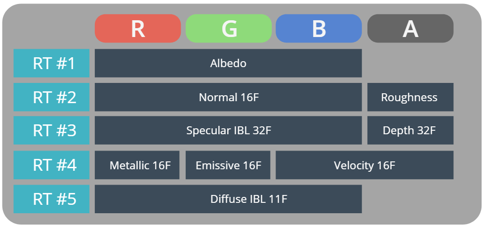

# Epsilon Engine

Epsilon Engine is a next-gen, multi-platform, general purpose game engine.

Written in modern C++ and GLSL 4.3+

## Dependencies

* Bullet Physics 2.82-r2704
* Zlib
* GLM 0.9.7.1 
* GLEW 2.0.0
* GLFW 3.2
* libinih
* Freetype 2
* Soft OpenAL 1.18.2

## Features

* Bullet Physics integration
* Physically Based Shading
* Bokeh DoF
* Volumetric Lighting
* Deferred rendering
* Skeletal Animation
* Spherical Harmonics Global Illumination
* BSP Support
* GPU accelerated particle systems
* Dynamic Skybox and day time cycle
* Dynamic terrain generation
* Custom GUI

### G buffer structure

